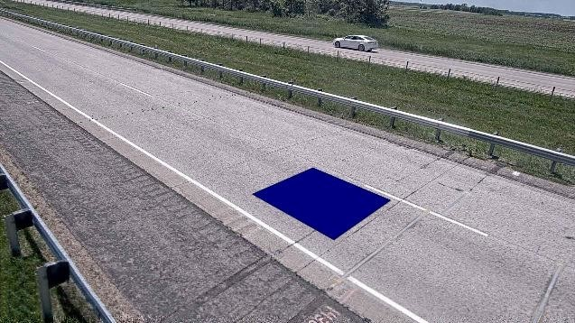
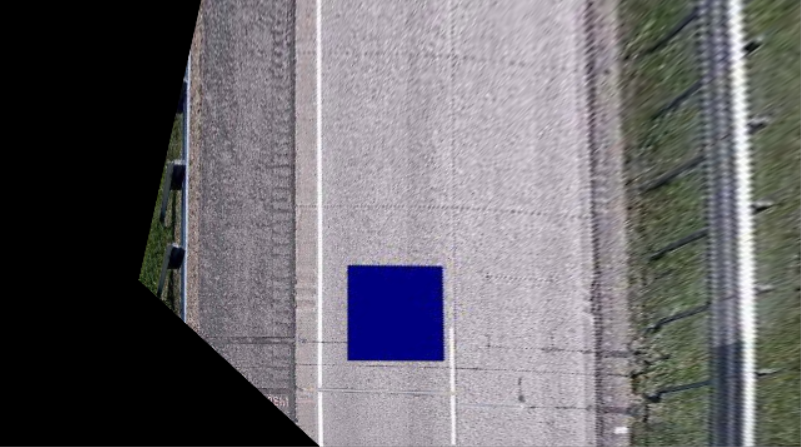
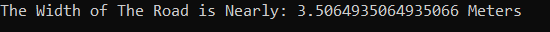

# Top View Of A Tilted Image

Given a tilted image of a road with a box printed on it which has a known width (75 CM).
I was able to construct the top view of the image with the help of OpenCV image processing methods,
and I also was able to calculate the estimated real width of the road.

## Task Set Up and Installation

#### 1. Clone the repository: 

```
git clone https://github.com/alaagamal98/image-processing-task.git
```

#### 1. Running The Code:

Run the following command on a new terminal window.

```
python topview.py -i images/road_final.jpg
```

## Results

**Original Image:** 

**Top View Image:** 

**The Estimated Width of the Road:** 